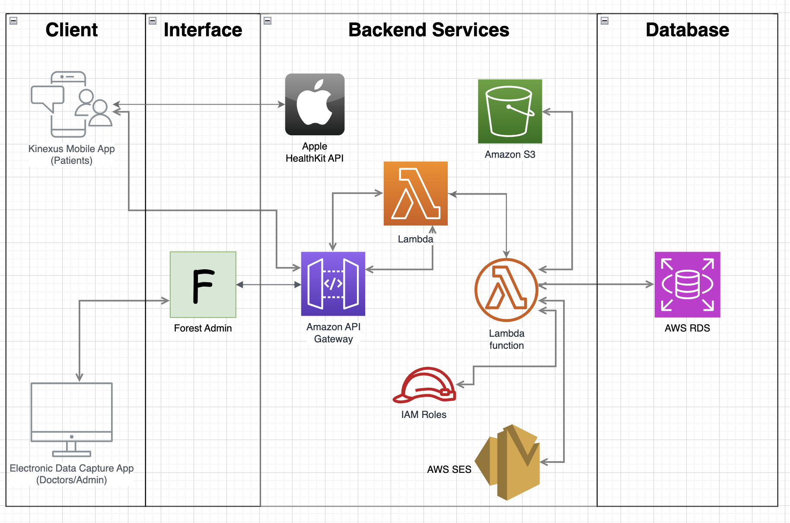
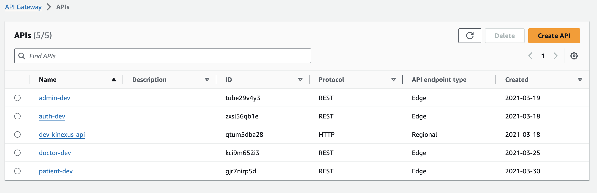
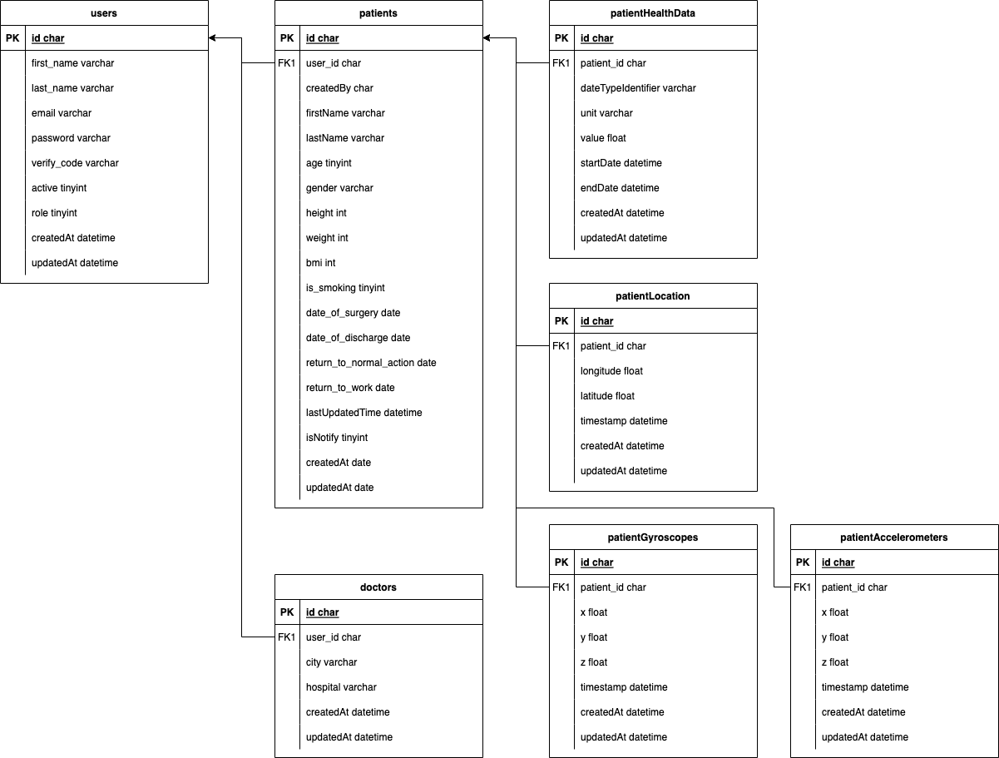

# kellern-io

> Documentation for [Kinexus](https://github.com/kellern-io) repositories.

Kinexus follows the general principle of serverless, microservices architecture. Each user action that requires CRUD operation in conjunction with the RDS is executed by sending a HTTP request to an API Endpoint, which in turn triggers a Lambda function that interacts with the RDS. The software architecture can be diagrammed like this: 

## Kinexus
> [Repo Link](https://github.com/kellern-io/kinexus/tree/main/src)

Links to Login websites:

AWS Amplify Homepage
https://main.d2qpsvca3mku37.amplifyapp.com

Admin Login
https://main.d2qpsvca3mku37.amplifyapp.com/admin/login

Doctor Login
https://main.d2qpsvca3mku37.amplifyapp.com/login

### src/crud
The crud.js files contain functions that make HTTP requests to the **Forest-Admin** interface (kinexus-dashboard) with the associated parameters. Depending on type of function, it send requests with a body. For example, for getPatient function in patient.crud.js, it makes a POST request with the patient ID for a key-value lookup in the RDS. 

        import { apiGetRequest, apiPostRequest } from "./helper";
        const BASE_URL = process.env.REACT_APP_DOCTOR_BASE_URL;
        const PATIENT_URL = BASE_URL + '/patients';

        export const getPatient = (patientId) => {
            return apiGetRequest(PATIENT_URL + `/${patientId}`);
        }
Note that the HTTP requests are made using the **Axios** library. 

### src/store
The code in this folder utilizes the `redux` library and manages state changes in the application, then triggers/dispatches functions depending on the state. It effectively handles asynchrnous actions within the application. As seen in `store/store.js`, the entire state of the application is contained in a `Redux store` in the form of a state tree, where each node contains a `reducer` and `redux middleware`. `reducer` helps determine the next state based on retrieved action, and `redux middleware` write action creators that return a function. 

        const store = createStore(
            rootReducer,
            composeEnhancers(applyMiddleware(thunk))
        );

Let's look at an example (src/store/ducks/patient.duck.js):

        import { getPatients, addPatient, getPatientCredentials, resetPatientCredentials, deletePatient, getPatient, updatePatient, getPatientHealthData } from "../../crud/patient.crud"
        export const actionTypes = {
            PATIENTS_LOADING: "PATIENTS_LOADING",
            PATIENTS_SUCCESS: "PATIENTS_SUCCESS",
            PATIENTS_FAIL: "PATIENTS_FAIL",
            PATIENT_ADD_LOADING: "PATIENT_ADD_LOADING",
            PATIENT_ADD_SUCCESS: "PATIENT_ADD_SUCCESS",

           //and other actionTypes...
        }

        const initalState = {
            patients: []
        }

        const thunkedPatients = () => {
            return (dispatch) => {
                dispatch(actions.getPatientsLoading(true));
                getPatients()
                    .then(response => {
                        if (response.status !== 200) {
                            throw Error(response.data.message);
                        }
                        dispatch(actions.getPatientsLoading(false))
                        return response.data;
                    })
                    .then(data => {
                        dispatch(actions.getPatientsSuccess(data))
                    })
                    .catch((err) => {
                        dispatch(actions.getPatientsFail(err.message))
                    });
            }
        }

        const thunkedAddPatient = (patient) => {
            return (dispatch) => {
                dispatch(actions.addPatientLoading(true));
                addPatient(patient)
                    .then(response => {
                        if (response.status !== 200) {
                            throw Error(response.data.message);
                        }
                        dispatch(actions.addPatientLoading(false))
                        return response.data;
                    })
                    .then(data => {
                        dispatch(actions.addPatientSuccess(data));
                    })
                    .catch(err => {
                        dispatch(actions.addPatientFail(err.message));
                    })

            }
        }

        // and other thunks...

        export const actions = {
            getPatients: thunkedPatients,
            getPatientsLoading: isLoading => ({ type: actionTypes.PATIENTS_LOADING, isLoading }),
            getPatientsSuccess: patients => ({ type: actionTypes.PATIENTS_SUCCESS, patients }),
            getPatientsFail: errorMessage => ({ type: actionTypes.PATIENTS_FAIL, errorMessage }),
            // and other actions ....
        }

        export const reducer = (state = initalState, action) => {
            switch (action.type) {
                case actionTypes.PATIENTS_LOADING:
                    return {
                        ...state,
                        isLoading: action.isLoading,
                        message: undefined
                    };
                case actionTypes.PATIENTS_SUCCESS:
                    return {
                        ...state,
                        patients: action.patients
                    };
                
               // and other cases ....
            }
        }

Here are the main components:

1. **Action Types:**
   - `actionTypes` object defines constants for different types of actions that can be dispatched.

2. **Initial State:**
   - The `initialState` object initializes the state with an empty array of patients.

3. **Thunks:**
   - The thunks are responsible for making API calls and dispatching corresponding actions based on the results.

4. **Actions:**
   - The `actions` object contains action creators. Action creators are functions that return action objects. These actions include loading, success, and failure states for various operations related to patients.

5. **Reducer:**
   - The `reducer` function handles how the state should change in response to different actions. It updates the state based on the action type and the associated data.

6. **Switch Case:**
   - The switch case inside the reducer determines how the state should be updated for each action type. For example, when loading patients (`PATIENTS_LOADING`), it sets the loading flag to true, and when the operation is successful (`PATIENTS_SUCCESS`), it updates the state with the fetched patients.

7. **Immutable Updates:**
   - The reducer appears to be using the spread operator (`...`) to create new objects or arrays when updating the state. This is a common practice in Redux to ensure immutability and prevent unintentional side effects.

## Sequelize Models
In both Kinexus-api and Kinexus-dashboard, Sequelize is integrated to define Sequelize models (in /models). Sequelize is an Object-Relational Mapping (ORM) library for Node.js, and it allows developers to interact with databases using JavaScript.

Let's look at an example:

        module.exports = (sequelize, DataTypes) => {
        const { Sequelize } = sequelize;
        const Patients = sequelize.define('patients', {
            id: {
            type: DataTypes.STRING,
            primaryKey: true,
            allowNull: false,
            },
            firstName: {
            type: DataTypes.STRING,
            },
            lastName: {
            type: DataTypes.STRING,
            },
            age: {
            type: DataTypes.INTEGER,
            },
            ....
        }, {
            tableName: 'patients',
        });

        Patients.associate = (models) => {
            Patients.belongsTo(models.users, {
            foreignKey: {
                name: 'userIdKey',
                field: 'userId',
            },
            as: 'user',
            });
            ....
        };
        return Patients;
        };

1. **Model Definition:**
   - The model is named "Patients," representing the "patients" table in the database.

2. **Table Fields:**
   - The table has various fields, each corresponding to a column in the "patients" table. These include fields such as `id`, `firstName`, `lastName`, `age`, etc.
   - **Sequelize**'s `DataTypes` are used to define the types of these fields (e.g., `STRING`, `INTEGER`, `DATEONLY`).

3. **Field Options:**
   - Constraint Options like `primaryKey`, `allowNull`, and `defaultValue` are set for certain fields.

4. **Field Mapping:**
   - Some fields are mapped to different column names in the actual database using the `field` property (e.g., `is_smoking` in the database corresponds to `isSmoking` in the model).

5. **Table Name:**
   - The `tableName` property is used to explicitly specify the table name as "patients."

6. **Associations:**
   - The `associate` function establishes associations (relationships) between the "Patients" model and other models (`users`, `patientHealthData`, `patientLocations`, `patientAccelerometers`, `patientGyroscopes`) in the system.
   - For example, it defines that a "Patient" belongs to a "User" (via the `belongsTo` association).

8. **Foreign Keys:**
   - The associations include foreign keys (`foreignKey` property) that link records in the "patients" table to related records in other tables.

Such definition provides a structured way to interact with the "patients" table and its associated data in the database using Sequelize. It also sets up relationships with other tables, allowing for more complex queries and data retrieval.

## Kinexus-api
> [Repo Link](https://github.com/kellern-io/kinexus-api)

This repository defines the **AWS Lambda** functions. These are exported to AWS S3 along with its dependencies as deployment packages. 

Some common commands in lambda functions: 

1. `context.callbackWaitsForEmptyEventLoop = false`

- This enables Lambda function to not wait for the event loop to be empty before terminating. This allows us to terminate the Lambda function quickly, even if there are asynchronous operations that have not completed.

2. POST requests, `validateInput`(\lib\utils.js) 

- Uses `node-input-validator` library to validate the inputted payload data. 

3. save()

- save() operation is a part of Sequelize's built-in capabilities for working with instances of the model.
When you create or retrieve an instance of a Sequelize model, it represents a specific record in the associated database table. The save() method is used to persist changes made to the instance back to the database.

### admin
`admin` is in charge of lambda functions associated with an admin user. Admin functionalities include : 

- Get admin users (`getAdmins`)
- Add/Get doctor(s) (`addDoctor`, `getDoctor`, `getDoctors`)
- Update/Delete doctor (`updateDoctor`, `deleteDoctor`)

### auth
`auth` is in charge of lambda functions associated with authenticating a user. More specifically, `auth` is an authorization handler for API Gateway, verifying JWT tokens and generating an AWS policy to control access to the specified resources. Auth functionalities include :

- Login (`login`)
- Sending verfication email (`send_code`)
- Authorization (`auth`)

### config

`config` is a configuration file that configures connection between Lambda functions and other AWS Services (i.e. credentials and base url for the AWS RDS)

### doctor

`doctor` is set of lambda functions associated with a doctor. Doctor functionalities include:

- Get patient(s) (`getPatient`, `getPatients`)
- Get patient data (`getPatientHealthData`, `getPatientCredentials`)
- Create/delete/update patient (`addPatient`, `deletePatient`, `updatePatient`)

### patient

`patient` is a set of lambda functions associated with a patient. Patient functionalities include:

- Update patient data (`updateHealthData`, `updateBulkData`)
- Send(email) data upload reminder (`sendUploadReminder`)

### Sending email using AWS SES Client

The code that uses `nodemailer` library ans **AWS SES** to send email to a user is defined in `lib/sesClient.js`. 

## Kinexus-dashboard
> [Repo Link](https://github.com/kellern-io/kinexus-dashboard)

### routes
The routes folder is responsible for utilizing Express and Forest Admin to create a web-based admin interface for managing data in a Sequelize-based database. Forest Admin is a tool that helps you generate an admin interface for your database models. In other words, you define resources in Forest Admin, representing tables in AWS RDS or objects in the application.

Let's break down the code:

1. **Dependencies:**
   - `express`: A web application framework for Node.js.
   - `PermissionMiddlewareCreator` from `'forest-express-sequelize'`: Forest Admin middleware for handling permissions.
   - models from `'../models'`: A Sequelize model to map objects for different tables.

2. **Permission Middleware Creator:**
   - Instantiates a `PermissionMiddlewareCreator`. This is used to handle permissions for each route.

            #Creates the patients resource
            const permissionMiddlewareCreator = new PermissionMiddlewareCreator('patients');

            #Trigger for creating a new record
            permissionMiddlewareCreator.create()

            #Trigger for updating an existing record
            permissionMiddlewareCreator.update()

            #Trigger for retrieving list of records
            permissionMiddlewareCreator.list()

            #Trigger for deleting a record
            permissionMiddlewareCreator.delete()

            #Trigger for retrieving a record
            permissionMiddlewareCreator.details()

            #Pass the request to AWS API Gateway
            next()

Overall, this code sets up routes for basic CRUD (Create, Read, Update, Delete) operations on tables in RDS and ensures that Forest Admin's permission middleware is applied to control access to these routes.

## Kinexus-ios
> [Repo Link](https://github.com/kellern-io/kinexus-ios)

## Kinexus-android
> [Repo Link](https://github.com/kellern-io/Kinexus-android)

# AWS Services

## IAM

Developer should be assigned an **IAM Role** to gain access to **AWS Management Console** and other AWS services employed in this project. 

## Amplify

Amplify is used to host the frontend of the Electronic Data Capture application (kinexus). 

## API Gateway

The AWS Lambda functions are exposed as APIs, using Amazon API Gateway as an entry point. API Gateway automatically handles the management and distribution of incoming requests to your Lambda functions. 

Within the AWS Management Console -> API Gateway, you should be able to see, manage, and add new API endpoints for the lambda functions. 

## S3

Here's a process of deploying Lambda code through S3:
1. **Package Code:** Create a deployment package (ZIP file) containing your Lambda function code and dependencies.
2. **Upload to S3:** Upload the deployment package to an S3 bucket.
3. **Lambda Deployment:** Update the AWS Lambda function, specifying the S3 location of the deployment package.

AWS Lambda code is deployed via Amazon S3 for these reasons:

1. **Artifact Size:**
   - AWS Lambda has size limitations on deployment packages that can be directly uploaded through the AWS Management Console. Using Amazon S3 allows you to handle larger deployment packages.

2. **Package Management:**
   - Storing Lambda deployment packages in Amazon S3 provides a centralized and scalable location for managing different versions of deployment artifacts, allowing you to maintain different versions of your Lambda deployment artifacts. This facilitates easy rollbacks in case an issue arises with a new deployment.

3. **Reduced Deployment Time:**
   - Uploading large deployment packages directly to AWS Lambda can increase deployment times. By using Amazon S3, you can optimize the deployment process, as AWS Lambda can quickly retrieve the deployment package from S3 during the deployment phase.

4. **Permissions and Security:**
   - AWS Lambda and Amazon S3 can have separate access controls. Storing the deployment package in S3 allows you to manage permissions independently, ensuring that only authorized entities can access or modify the deployment artifacts.

5. **Offline Development and Testing:**
   - Storing deployment artifacts in Amazon S3 enables offline development and testing. Developers can download the required deployment packages from S3 to their local environments for testing or debugging.

## Lambda

AWS Lambda functions handle various aspects of health data updates, bulk data updates, sending reminders and etc., utilizing Sequelize for database interactions and **AWS SES Client** for notifications. 

## RDS 
Relational Database for all data. The tables stored in this instance is as listed below.
1. users
2. usersToken
3. SequelizeMeta
4. patients
5. patientLocations
6. patientHealthData
7. patientGyroscopes
8. patientAccelerometers
9. doctors

The tables are related by the IDs of each user as follows:

### MySQLWorkbench

The inbound rules of RDS denies access from unknown IPs. To test and query from personal IP, we login to an **AWS EC2** instance with an associated security group that has access to the **RDS**, and then connect to the database. 

1. Download MySQLWorkbench
2. From the upper menu, go to **Database** -> **Connect to Database**.
3. Select **Connection Method** : Standard TCP/IP over SSH.
4. Enter the following information in the **Parameters** tab:
        SSH hostname: 18.218.108.30 
        SSH username: ec2-user 
        SSH Password: Kinexus12345 
        SSH Key File: leave it empty 
        MySQL Hostname: kinexus.cw3a1czyi468.us-east-2.rds.amazonaws.com 
        MySQL Server Port: 3306 
        Username: admin 
        Password: Dev12345 
        Default Schema: leave it empty 
5. Click **OK**
